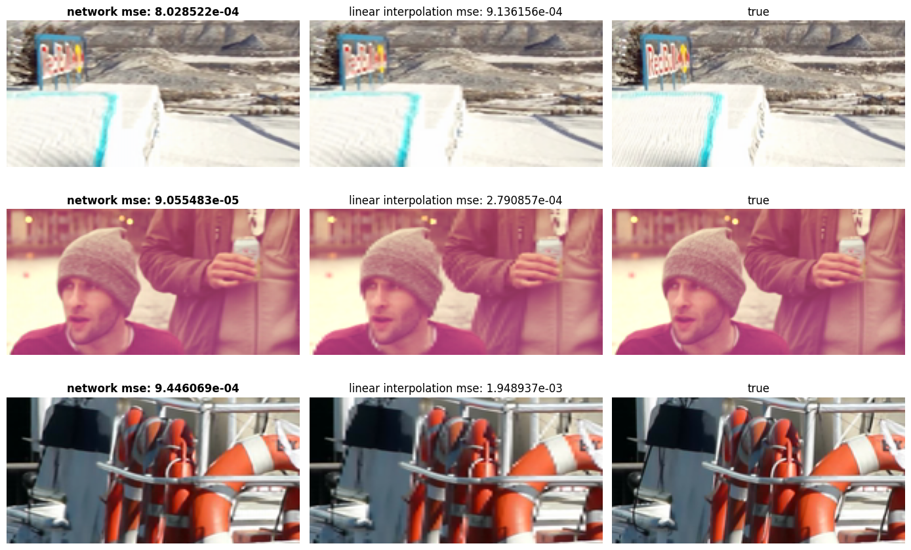

# FrameBoostUS
This repository is an implementation of the paper [Deep Deinterlacing](https://studios.disneyresearch.com/2020/11/10/deep-deinterlacing/) by Disney research.


*Results generated with the pretrained model which was trained for 10000 iterations.*

> **Warning**
> I am not one of the authors of the paper. The code in this repository was independently produced. It might contain errors and likely does not perfectly reflect what the authors did.

> **Warning**
> In the original paper the interlacing is in the horizontal direction. This implementation works with interlacing in the vertical direction. This should not be too difficult to change however.

## Setup
### Installing requirements
Install the desired version of `pytorch` and `torchvision` as described on the [pytorch website](https://pytorch.org/).

Run the following command to install all other dependencies.
```
pip install -r requirements.txt
```

### Experiment tracking
To track experiments with Weights and Biases first install the `wandb` package.
```
pip install wandb
```
Then login with your Weigths and Biases authorization key using the following command
```
wandb login
```
To enable the experiment tracking set `wandb` to `true` in the model training config file.

### Training a model
1. Make sure to download the [dataset](http://toflow.csail.mit.edu/) first and place it in the `data` folder.
2. Ensure all settings desired in the file `training_config.yaml` and `disney_model.yaml`
3. Run
```
python train_model.py
```
To train on the GPU add the argument `--gpu 0` to train on GPU 0.

### Further information
- [Model definitions and training](src/models/README.md)
- [General utility functions](src/utils/README.md)
